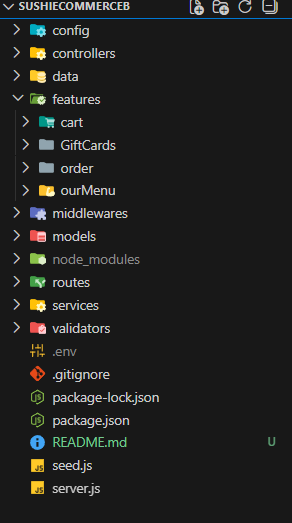

# 🍣 Sushi E-commerce – Backend API

Backend REST API for the **Sushi E-commerce** platform.  
It handles authentication, product management, cart logic, orders, payments, and gift cards.

Built with a **scalable, feature-based architecture**, following industry best practices.

---

## 🚀 Features

- User authentication (JWT)
- Product & menu management
- Cart persistence via custom cart ID
- Secure checkout with **Stripe**
- Stripe Webhooks handling
- Gift card system
- MongoDB data persistence
- CORS configuration for production frontend

---

## 🛠 Tech Stack

- **Node.js**
- **Express**
- **MongoDB + Mongoose**
- **JWT Authentication**
- **Stripe API**
- **Zod** (schema validation)
- **bcrypt** (password hashing)
- **UUID**
- **Express Rate Limit**

---

## 🧱 Architecture

The project follows a **layered and feature-based architecture**, separating concerns to ensure maintainability and scalability.

### Layers

- **Routes** – API endpoints
- **Controllers** – Request/response handling
- **Services** – Business logic
- **Models** – Database schemas
- **Validations** – Input validation (Zod)
- **Server** – App configuration and middleware

### Feature-based structure

Each domain (auth, menu, cart, checkout, gift cards) is isolated within its own feature folder.

---

## 📂 Folder Structure (Simplified)

  

---

## 🔗 API Routes

| Method | Endpoint         | Description          |
| ------ | ---------------- | -------------------- |
| POST   | `/user/login`    | User login           |
| POST   | `/user/register` | User registration    |
| GET    | `/api/menu`      | Get menu items       |
| POST   | `/cart`          | Create / update cart |
| POST   | `/api/orders`    | Checkout process     |
| POST   | `/api/webhooks`  | Stripe webhooks      |
| POST   | `/api/giftcards` | Gift card handling   |

---

## 🔐 Security & Payments

- **JWT-based authentication**
- **Password hashing with bcrypt**
- **Rate limiting for sensitive routes**
- **Stripe Webhooks** validated using raw body middleware
- Secure environment variables handling

---

## 📬 Contact

- LinkedIn: [Facundo Robert](https://www.linkedin.com/in/robertfacundodev/)
- Portfolio: [My Portfolio](https://facundorobert.vercel.app/) 
- Email: robertf.coder@gmail.com